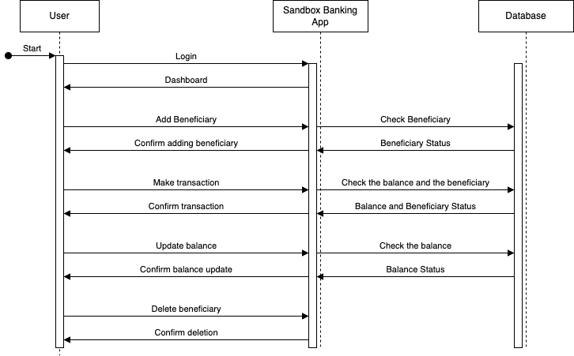

# Introduction

The Corebank Sandbox solution is providing an online banking system environment for the customer to try out all the self-banking-related tasks. This is a sandbox environment to provide a well-managed banking system to get understand all the solutions that we provide by our Open Banking solution.

# Ecosystem & participants

The banking system comprises of three main components; Account management, Transaction management, and Beneficiary management.

Account management allows users to create new accounts, update and delete their accounts, change the default / primary account, and update the account balance.

Transactions management allows users to make transactions and view transaction history. Transaction history includes all the required details related to the transaction.

Beneficiary management allows users to add and delete their account beneficiaries. Users then can mention added beneficiaries while doing a transaction.

All the users who are willing to try out our Open Banking solutions can participate in the Corebank Sandbox system.

# User Journey

