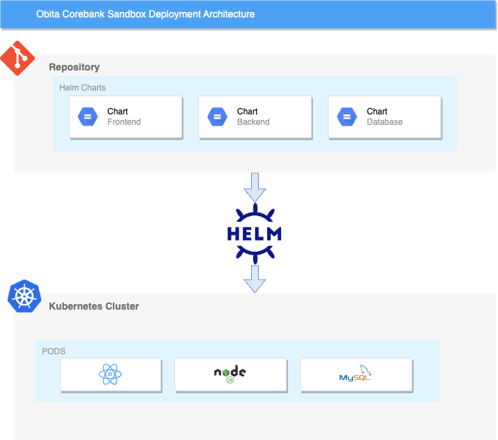

# Deployment Guide: Corebank Sandbox Solution

This deployment guide is designed to help customers deploy the Corebank Sandbox solution in various environments. Our solution provides a comprehensive set of APIs and services to enable banks to extend their functionality and comply with Banking requirements. This document focuses on the deployment options available for the Corebank Sandbox solution.

## DeploymentArchitecture



## Deployment Options

### Deploy on Kubernetes

The Corebank Sandbox solution can be deployed on the cloud Kubernetes infrastructure using Helm. This option provides more control and flexibility over the deployment environment. The process of the deployment on Kubernetes is as follows:

- Install Kubernetes and Helm on your environment
- Add the Obita Helm repository to your Helm installation
- Install the Corebank Sandbox solution using the provided Helm chart and configuration
- Access the solution through the provided URL

#### Steps to deploy

Clone the catalog repository

```bash
git clone https://gitlab.techventuras.com/wso2-ob/obita-catalog-helm.git
```

Locate the project

```bash
cd obita-catalog-helm/obita-corebank-sandbox/
```

Run the command

```bash
make install-obita-corebank-sandbox-app
```

```bash
make push-obita-corebank-sandbox-chart-to-repo
```
