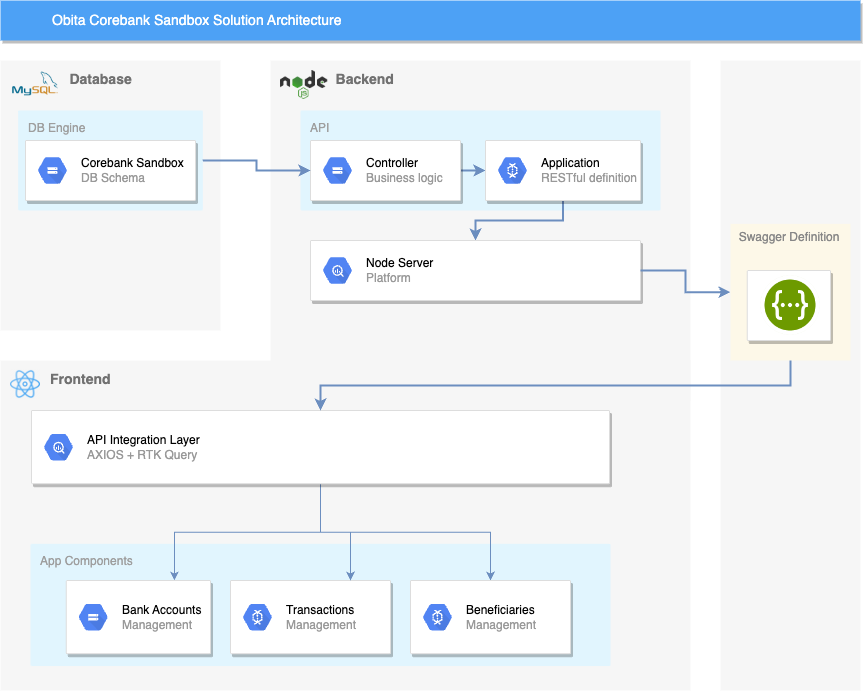

# Developer Guide: Obita Corebank Sandbox

## Introduction

This developer guide is designed to help developers understand and work with the corebank sandbox solution. This solution consists of creating bank accounts, making transactions, adding and managing beneficiaries, managing funds, managing standing orders, manage direct debits and third parties. Users can check their transaction history and query through all the transactions.

## Solution Architecture



The Corebank Sandbox solution is built using the microservices architecture. The system comprises several independent services that communicate with each other using RESTful APIs.

## Getting Started

### System Requirements

To work with our Open Banking solution, you will need the following:

A computer with a modern web browser
An IDE, such as Visual Studio Code
Docker and Docker Compose installed

### Backend Setup

The backend is developed using Node.js and has three main components; the App, the Controller, and the DB Process. Following is the set of tasks to run the backend application:

- Clone the repository from GitHub

```bash
git clone https://github.com/psrimaltv/obita-corebank-sandbox-be.git
```

- Go to the directory

```bash
cd obita-corebank-sandbox-be
```

- Install dependencies

```bash
npm install
```

- Install nodemon

```bash
npm install nodemon -g
```

- Run the application

```bash
nodemon server.js
```

#### Main components of the backend

##### App :

This is the component where all the REST APIs are declared. All the requests and responses are handled here.

##### Controller :

This is the component to handle the business logic of all the REST APIs exposed through the App. All the database interactions go here.

##### DB Process :

This is the component to handle the database configurations.

### Frontend Setup

The front end is developed using React.js and has two main components; account management, transaction management, and beneficiary management. Following is the set of tasks to run the frontend application:

- Clone the repository from GitHub

```bash
git clone https://github.com/psrimaltv/obita-corebank-sandbox-fe.git
```

- Go to the directory

```bash
cd obita-corebank-sandbox-fe
```

- Install dependencies

```bash
npm install
```

- Run the application

```bash
npm start
```

#### Main components of the frontend

##### Account Management :

This is the component where all the account-related tasks are gathered. Users can check their account details with recent transactions. Users can create new accounts and also can update their account balance.

##### Transaction Management :

This is the component to handle all the transaction-related tasks. Users can make transactions and view the transaction history.

##### Beneficiary Management :

This is the component to handle all the beneficiaries related tasks. Users can add and delete their beneficiaries, and use them in transactions.

### API Documentation

The API documentation provides a comprehensive reference for the Corebank Sandbox APIs. The documentation includes the following: - API Reference - Authentication and Authorization - Data Formats - Error Handling

### Swagger UI [Link]

The Corebank Sandbox solution provides a Swagger UI to explore and interact with the APIs. The Swagger UI allows you to:

    - View API endpoints and parameters
    - Try out API requests and see responses
    - Generate client code in multiple programming languages

### Error Handling

The Corebank Sandbox solution provides comprehensive error handling to help developers diagnose and resolve issues. The error handling includes the following:

Error Codes | Error Messages |
Troubleshooting Guide

### Security

Security is a critical aspect of Corebank Sandbox solutions. Our solution provides the following security features:

Strong Customer Authentication (SCA) |
Client Authentication |
OAuth2 Authorization Framework |
TLS Encryption

### Performance

The Corebank Sandbox solution is designed to perform under high loads. We use the following techniques to optimize performance:

Caching |
Asynchronous Processing |
Distributed Architecture

### Integration

The Corebank Sandbox solution is designed to integrate with third-party systems. We provide the following integration features:

API Management

### Support

If you encounter issues or have questions while working with the Corebank Sandbox solution, please contact our support team at `support@obita.tech`.
