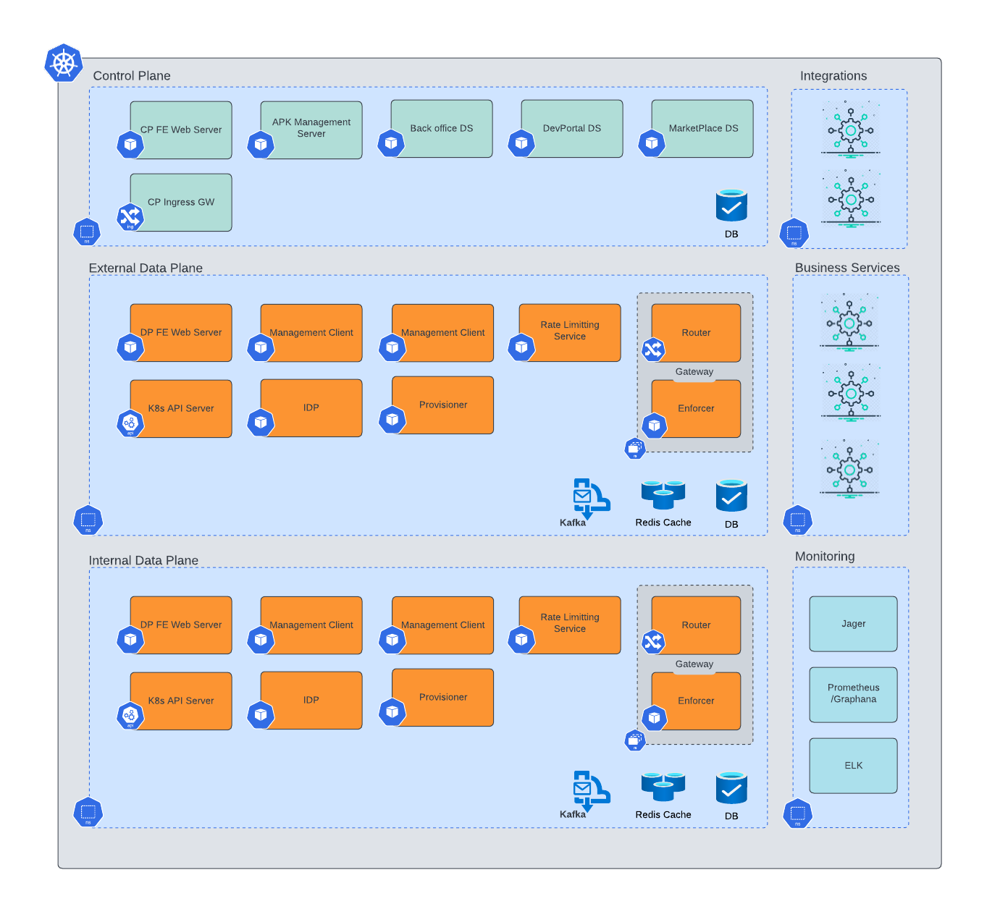

# Deployment Guide: Open Banking Solution
This deployment guide is designed to help customers deploy our Open Banking solution in various environments. Our solution provides a comprehensive set of APIs and services to enable banks to extend their functionality and comply with Open Banking requirements. This document focuses on the deployment options available for the Open Banking solution.

## DeploymentArchitecture

## Deployment Options

### Deploy on Obita Incubator
Our Open Banking solution can be deployed on the Obita Incubator, which is a complete solution deployed on an incubator environment managed by Obita. This option is ideal for evaluation purposes and provides an easy way to get started with our solution. The steps to deploy on the Obita Incubator are as follows:

- Create an account on the Obita  website
- Follow the instructions to create a new project and deploy the Open Banking solution
- Access the solution through the provided URL

### Deploy on Kubernetes
Our Open Banking solution can be deployed on a native or cloud Kubernetes infrastructure using Helm. This option provides more control and flexibility over the deployment environment. The steps to deploy on Kubernetes are as follows:

- Install Kubernetes and Helm on your environment
- Add the Obita Helm repository to your Helm installation
- Install the Open Banking solution using the provided Helm chart and configuration
- Access the solution through the provided URL
  
### Deploy on Obita SaaS Cloud
Our Open Banking solution can be deployed on the Obita SaaS Cloud, which is a Kubernetes platform managed by Obita. This option is ideal for customers who require a SaaS deployment and want the benefits of a managed environment. The steps to deploy on the Obita SaaS Cloud are as follows:

- Create an account on the Obita  website
- Follow the instructions to create a new project and deploy the Open Banking solution
- Access the solution through the provided URL

### Deploy on Private Data Plane
Our Open Banking solution can be deployed on a customer-managed Kubernetes infrastructure using the Obita Data Plane. This option is ideal for customers who require full control over their deployment environment and want to run the solution on their own infrastructure. The Obita Data Plane is currently supported only on Azure and AWS. The steps to deploy on a private data plane are as follows:

- Create a new Kubernetes cluster on your chosen cloud provider
- Install the Obita Data Plane on the cluster
- Install the Open Banking solution using the provided Helm chart and configuration
- Access the solution through the provided URL

